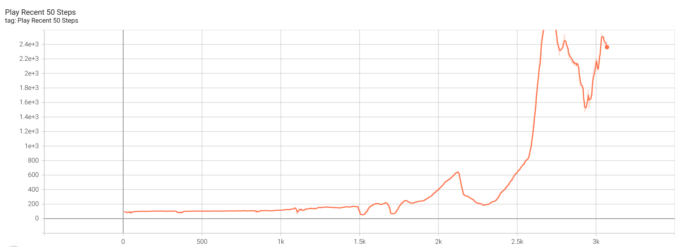

# 说明

本项目通过Double DQN算法实现了一个AI模型，可以顺利完成FlappyBird游戏。代码基于flappy-bird-gymnasium环境。

本项目附带一个我预训练好的一个模型，可以通过运行```bird_play_pretrain.py```体验效果，免去数个小时的训练时间。


训练大约需要2个小时（硬件：12600H + RTX 4060）。前1个小时，小鸟很容易死，卡在第一根管子。大约1.5小时后，小鸟技能出现突变，突然就玩得很好了。




你可以自己训练。在运行或训练前，你需要先配置好python+tensorflow环境。详见下节“环境准备”。


**此项目使用Python多进程**

主进程使用GPU训练模型。如果你没有GPU，也可以使用CPU，本模型训练算力要求并不大。模型训练约10分钟可以看到效果，小鸟此时差不多可以通过第一个管子。继续训练2~4个小时达到稳定，可以通过100+管子。辅助进程专门用于运行Agent，通过玩游戏持续生成ReplayBuffer。默认有5个Agent进程。

使用多进程是因为游戏训练到大后期时，小鸟出错概率很低，此时很难捕获到有价值的撞管帧，训练效果推进缓慢。因此我使用多个进程来加大玩游戏的频次，捕获更多的撞墙帧，提升训练效果。


**项目文件说明**

- bird_play_pretrain.py 执行我预训练好的模型，观察AI玩FlappyBird的效果。
- bird_train.py 训练代码。你可以运行此代码重头开始训练你自己的模型。模型每分钟保存一次到磁盘。当中止训练后，下次会自动从断点恢复。
- bird_play.py 在训练时，你可以运行此文件来即席观察训练效果。运行或中止此文件，不会打断训练过程。


# 环境准备

我的机器是Windows，以下是环境准备说明。


**安装anaconda**

建议以非管理员方式安装。

如果以管理员方式安装，需要注意目录是否有必要的读写权限。如果缺失，可以补充文件访问权限。

```
在anaconda3目录上，为Authenticated Users增加：修改...写入... 权限
```


**创建env**

1. 使用anaconda python 3.10，创建环境keras-py310

2. 为了保证pip是最新版本，此次可以手动升级pip一次
   ```
   conda upgrade pip
   ```


**设置pip国内镜像【可选】**

由于pip访问国外不稳定，建议按下面的方式配置pip国内镜像

```
新建 %UserProfile%/pip/pip.ini
编辑内容如下（清华pip源）
[global]
index-url = https://pypi.tuna.tsinghua.edu.cn/simple
[install]
trusted-host = https://pypi.tuna.tsinghua.edu.cn

或（阿里pip源）
[global]
index-url = https://mirrors.aliyun.com/pypi/simple/
[install]
trusted-host = https://mirrors.aliyun.com
```

**安装cuda支持【可选】**

```bash
# cuda
conda install -c conda-forge cudatoolkit=11.2 cudnn=8.1.0
```

**安装包括tensorflow在内的依赖包**

```
# 打开conda命令行【keras-py310】 （换成你的目录）
cd C:\_Alex\repos\repo_my_aliyun\_learning\gym-flappybird

# 检查pip.exe是keras-py310\Scripts\pip.exe
which pip.exe

# 安装
pip install -r requirements.txt

# 检查, Verify install:
python -c "import tensorflow as tf; print(tf.config.list_physical_devices('GPU'))"
```


# 代码写作心得

**不要使用train_on_batch,  predict_on_batch**

使用这些底层函数在我的机器上会导致如下问题

```
Optimization loop failed: CANCELLED: Operation was cancelled
```

**训练时可打开TensorBoard观察训练进度**

````
# 打开conda命令行【keras-py310】
conda activate keras-py310

# 进入目录（换成你的目录）
cd C:\_Alex\repos\repo_my_aliyun\_learning\gym-flappybird

# 运行TensorBoard
tensorboard --logdir logs/tensorboard

# 打开url
http://localhost:6006/
````

Tensorboard中q-values的理论上限是12.5分。

**推理加速predict**

```
输入只有1个时， 调用model(input)的速度大大快于model.predict(input)
输入只有1个时， CPU的运行速度大于GPU的速度
```

**flappy-bird-gymnasium 源码**

```bash
# 下载好 flappy-bird-gymnasium 
git clone https://github.com/markub3327/flappy-bird-gymnasium
cd flappy_bird_gymnasium/tests

# To play the game (human mode), run the following command:
python test_human.py

# To see a random agent playing, add an argument to the command:
python test_dqn.py

# To see a Deep Q Network agent playing, add an argument to the command:
python test_random.py
```